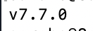

## Install ESLint

#### From the terminal run the following command:

```sh
npm i -g eslint
```

#### If you get an `EACCESS` error, run this command instead:

```sh
sudo npm i -g eslint
```

#### To validate this step is complete run this command:
```
eslint --version
```
####  You should see some numbers like so:

 

#### The exact numbers will probably be different, but as long as you're getting numbers, you can count this as a success!
