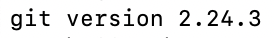

### 1) Install Git for Windows

<a href="http://msysgit.github.io/" target="_blank">Git for Windows</a> brings the full feature set of Git to Windows. (More on Git in a moment.) It also includes **Bash**, a popular Unix shell. Besides giving you the ability to talk to your computer by typing commands, it also lets you use Git in the command line, just like other Unix environments.

What's Git? It's a very popular **version control** system. Version control systems let programmers share and collaborate on code. With Git, multiple programmers can work on the same files, and Git keeps track of who made what changes, when. Git is usually used with a website, GitHub, that stores code (in "repositories") and lets programmers review and discuss changes before they are added. In short, Git makes everyone's lives easier.

To get started, download <a href="http://msysgit.github.io/" target="_blank">Git for Windows</a>. Once you click the "download" button, you'll see a list of download options.


Once you get it downloaded, double-click the file to open the installer. It will guide you through several options; the defaults are just fine, so keep on clicking "Next" until it's done.

When it's done installing, use the Start Menu to launch Git Bash. **TIP:** search for and open "Git Bash", not "Git CMD" or "Git GUI". Then, pin it to your Start Menu so it's easy to find.


After it's launched, you'll see something like this.


Ignoring the welcome message and the git help, here's a quick break down of what you're seeing in the Terminal app.

| Component             | Description                            |
| --------------------- | -------------------------------------- |
| `Ryan Sobol`          | Name of your user account              |
| `PHOTON-PC`           | Name of your computer                  |
| `~` (home directory)  | Name of your working directory         |
| `$`                   | Prompt symbol                          |


Simply stated, a Unix shell works in a read-evaluate-print loop or **REPL**.

### To validate this is complete run in your terminal:
```
git --version
```
### Should look similar to this in your terminal:


