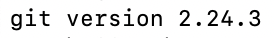

# Install Git for `Linux`


* Useful and command line [links](https://git-scm.com/download/linux) to pick your current running system and run in your terminal.

### To validate this is complete run in your terminal:
```
git --version
```
### Should look similar to this in your terminal:


What is git:
* By far, the most widely used modern version control system in the world today is Git. Git is a mature, actively maintained open source project originally developed in 2005 by Linus Torvalds, the famous creator of the Linux operating system kernel. A staggering number of software projects rely on Git for version control, including commercial projects as well as open source. Developers who have worked with Git are well represented in the pool of available software development talent and it works well on a wide range of operating systems and IDEs (Integrated Development Environments).

* Having a distributed architecture, Git is an example of a DVCS (hence Distributed Version Control System). Rather than have only one single place for the full version history of the software as is common in once-popular version control systems like CVS or Subversion (also known as SVN), in Git, every developer's working copy of the code is also a repository that can contain the full history of all changes.

* In addition to being distributed, Git has been designed with performance, security and flexibility in mind.

