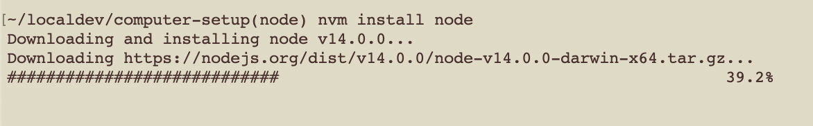
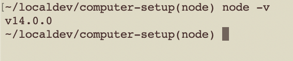

### Install Node

To install Node (a special version of Javascript that can, among other things, read and create files), the best option is to use NVM. Anything else will almost certainly cause issues down the line, especially with user permissions.

```https://github.com/nvm-sh/nvm```

1. Run this command in your terminal to install NVM `curl -o- https://raw.githubusercontent.com/nvm-sh/nvm/v0.35.3/install.sh | bash`

1. Close your terminal and open it back up again.
1. Type `nvm install node`. If this seems to do something cool, take a screenshot screenshot to submit as proof that you got this working.

It should look something like this:



1. Type `node -v` and take a screenshot. If it shows you some numbers, take a screenshot screenshot to submit as proof that you got this working.

It should look something like this:




### Troubleshooting

If it says `nvm` is not a recognized command:
    1. If it doesn't already exist, create a file called `.bash_profile` or `.zshrc` in your Mac's user home directory (the directory that has the same name as your Mac username). If one of these files exists already in your user home directory, just use that file for the next step.
    1. Add the following code to this file:
        ```js
        export NVM_DIR="$([ -z "${XDG_CONFIG_HOME-}" ] && printf %s "${HOME}/.nvm" || printf %s "${XDG_CONFIG_HOME}/nvm")"
        [ -s "$NVM_DIR/nvm.sh" ] && \. "$NVM_DIR/nvm.sh" # This loads nvm
        ```

### Congratulations!


### [⇐ Previous](3_git.md) |  [Next ⇒](5_eslint.md)
