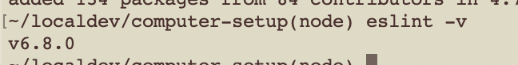

Setup ESLint
===

## Check Node Version

From terminal:

```sh
> node --version
```

## Install `eslint`

From terminal:

```sh
> npm install -g eslint
```

If above fails (for now):

```sh
> sudo npm install -g eslint
```

## Install VSCode Extension

(Skip if above failed)

* Search for "ESLint", author is Dirk Baeumer
* `Install`
* `Reload`

### Congratulations!

Type `node -v` in your git/bash console. If it shows you some numbers, take a screenshot screenshot to submit as proof that you got this working

It should look something like this:



### [⇐ Previous](5_node.md) | [README ⇒](../../../../)
