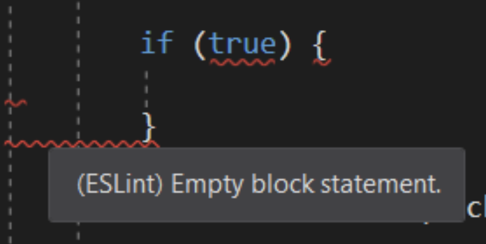

# Setup ESLint
===

ESLint is an amazing program that basically acts as a kind of 'spell check' for your code, underlining things in red squiggles if they don't look quite right and giving you hints about how to fix them, like so:



## Check Node Version

We will use node to install Eslint, so make sure your Node is working.

From terminal:

```sh
> node --version
```

## Install `eslint`

From terminal:

```sh
> npm install -g eslint
```

If above fails (for now):

```sh
> sudo npm install -g eslint
```

## Install VSCode Extension

(Skip if above failed)

* In VSCode, open the extensions panel. `Shift + CMD (or Ctrl) + X` should do the trick.
* Search for "ESLint", author is Dirk Baeumer
* `Install`
* `Reload`

### Congratulations!

Type `eslint -v` in your git/bash console. If it shows you some numbers, take a screenshot screenshot to submit as proof that you got this working

It should look something like this:


### [⇐ Previous](4_node.md) | [README ⇒](../../../../)