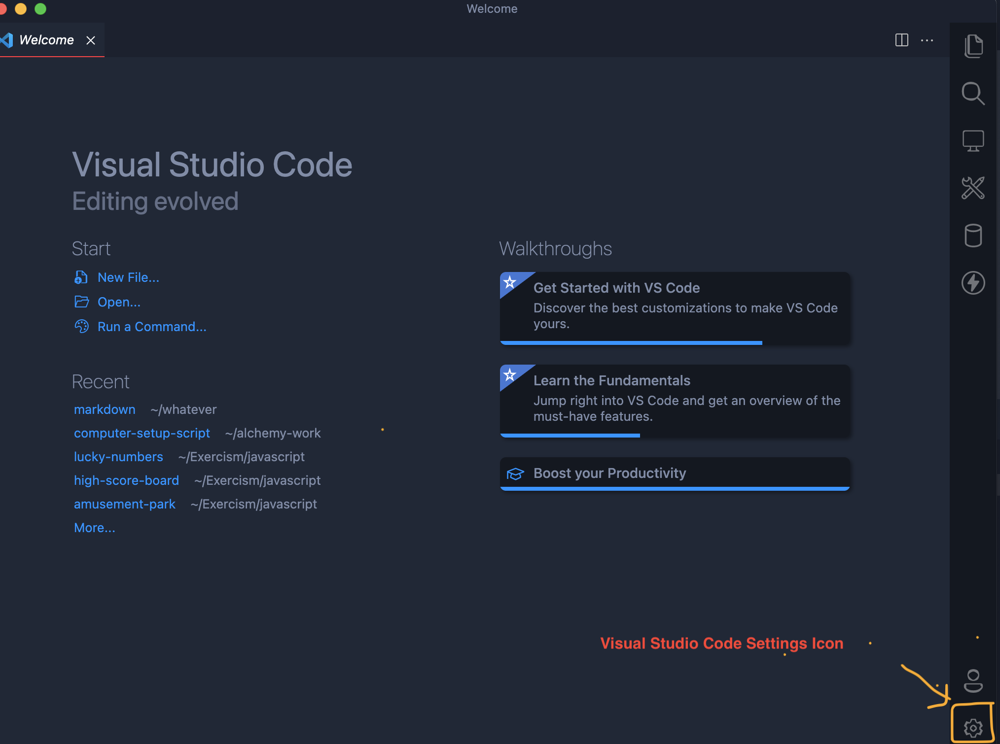
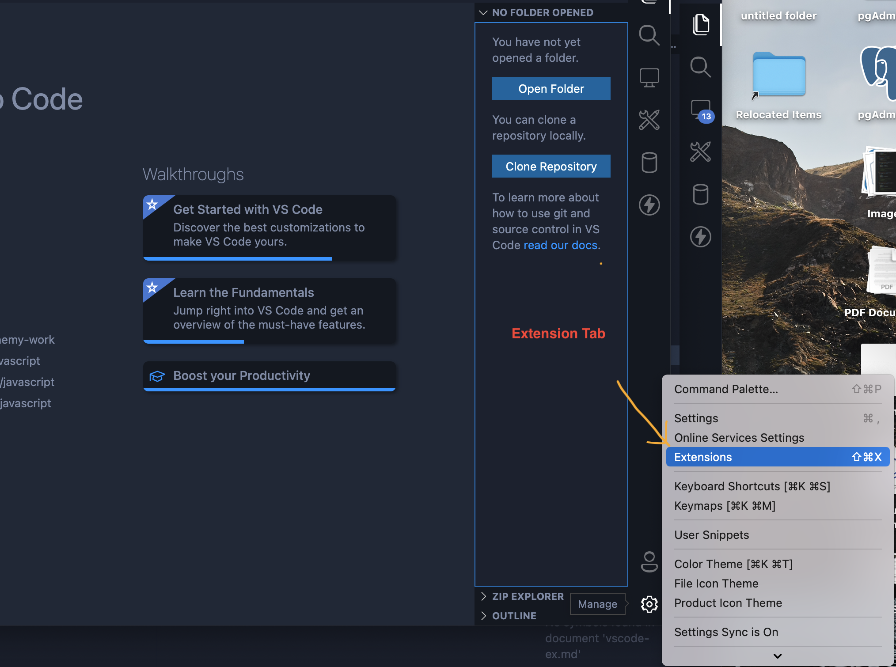
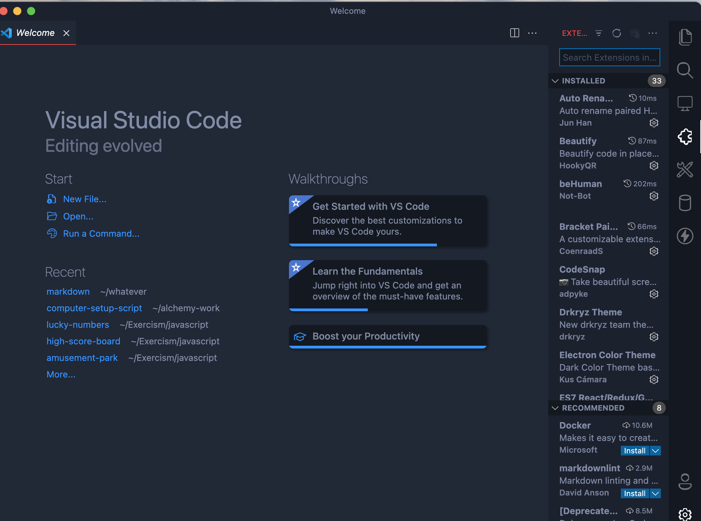
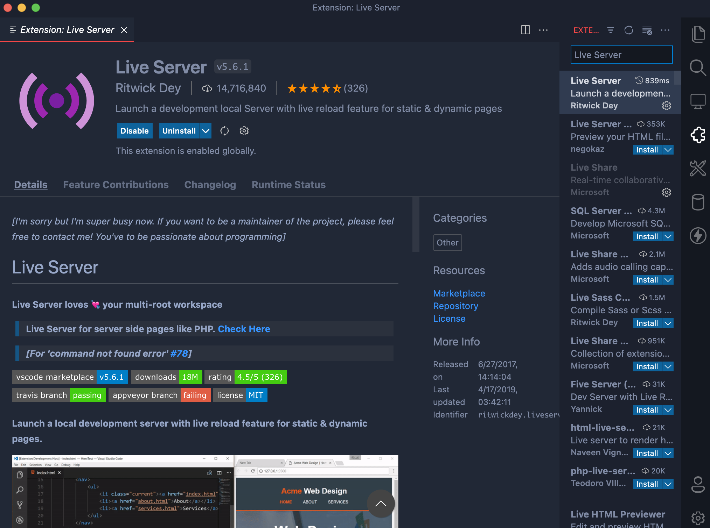

 1. Click the settings icon on your lower right side. 
 
 2. Scroll up to the extensions tab and click.
 
 3. If the first 2 steps are completed you should see this.
 
 4. Search for the extensions you need! 
 
 
### Install these:

    1. Live Server
    2. ESLint
    3. Code Spell Checker

### Here are few but there are many more to make your code cleaner and more readable.
[ `Useful` Visual Studio Code Extensions  ](vscode-ex.md)