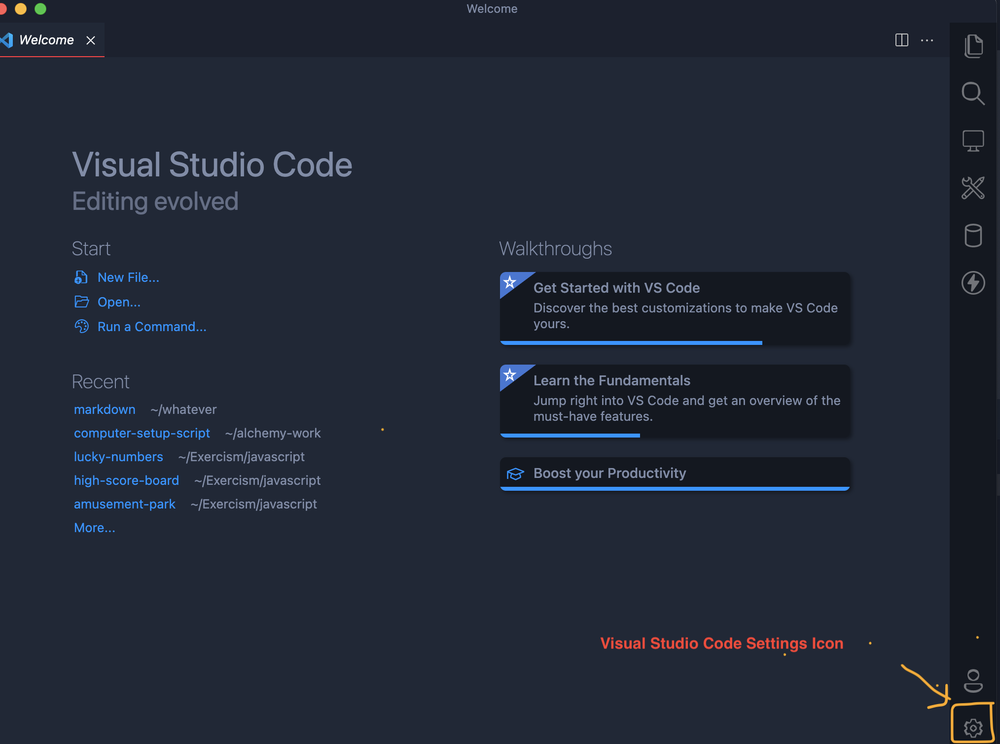
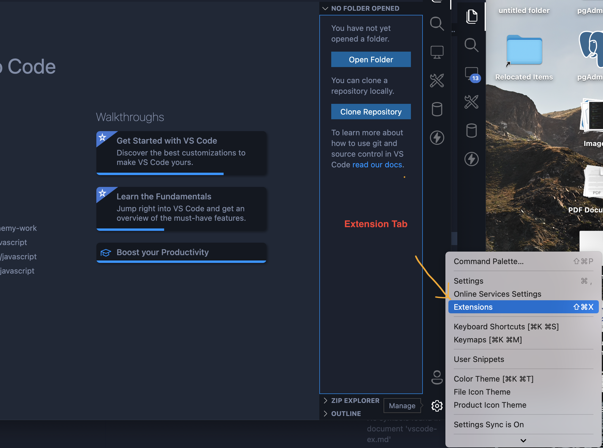
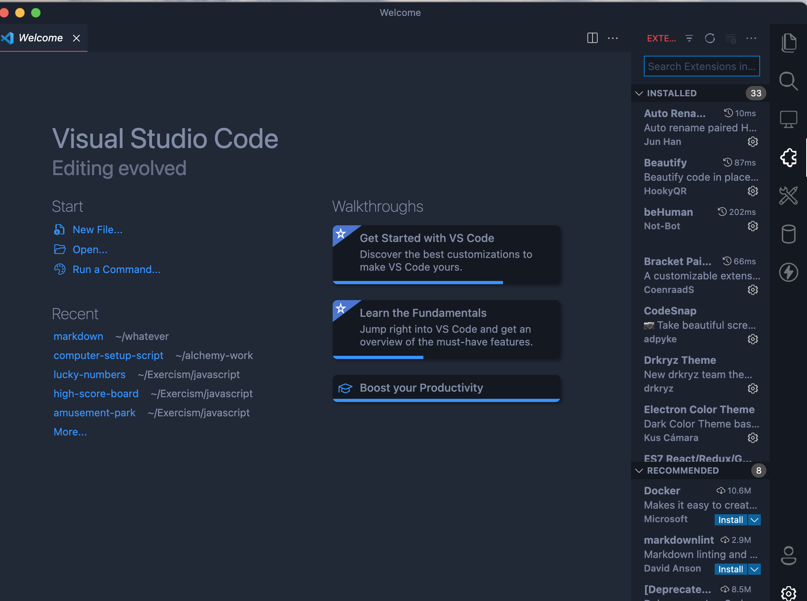
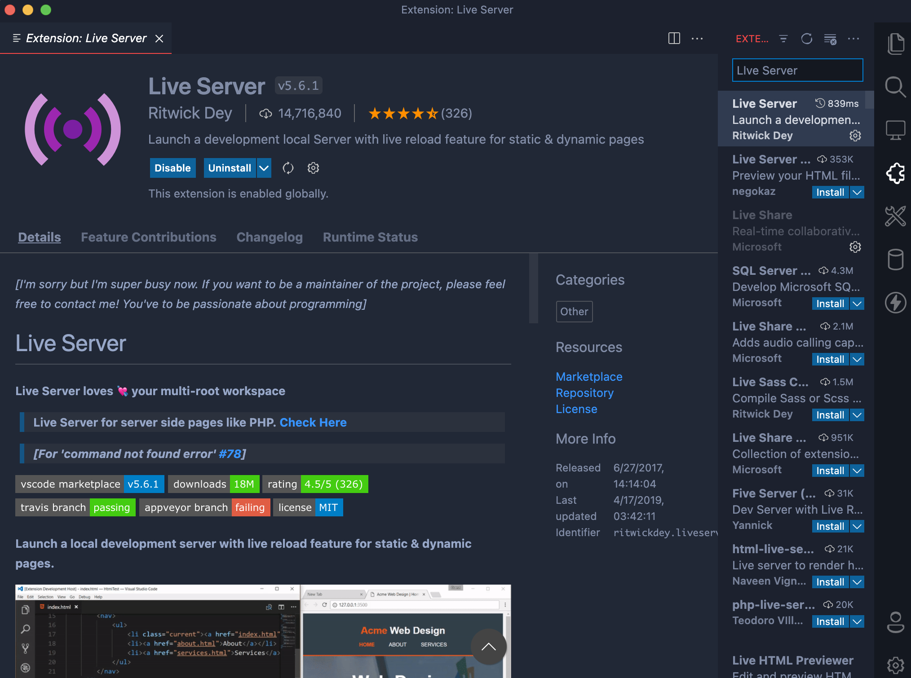

# 1. Click the settings icon on your lower right side. 

# 2. Scroll up to the extensions tab and click.

# 3. If the first 2 steps are completed you should see this.

# 4. Search for the extensions you need! 

* Here are few but there are many more to make your code cleaner and more readable.
    1. Indent-rainbow
    2. beHuman 
    3. markdownlint
    4. htmltagwrap
    5. Commit Reminder